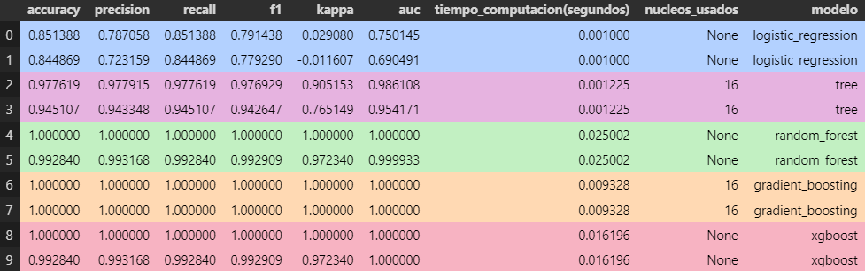
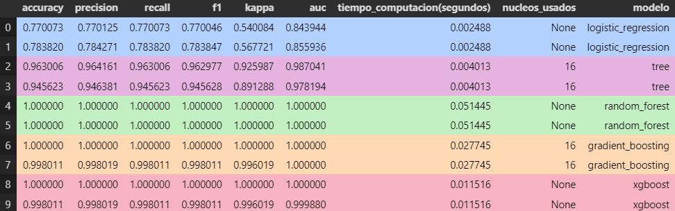
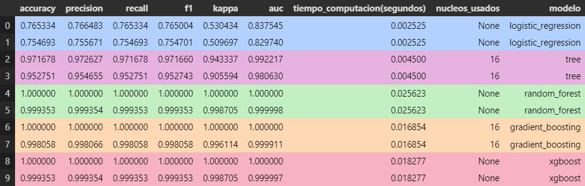
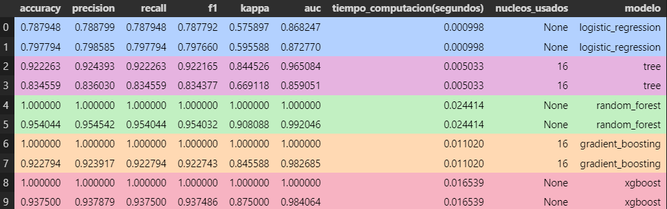
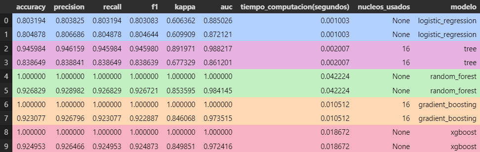

# 📊 Proyecto 8: Predicción de empleados

## 📖 Descripción del Proyecto

Este proyecto aborda uno de los mayores retos de Recursos Humanos: la rotación de empleados. La pregunta central es: ¿qué factores influyen en que un empleado decida quedarse o irse de la empresa? Para responder a esta pregunta, hemos utilizado datos ficticios de encuestas, métricas de desempeño y otras características de los empleados para desarrollar un modelo predictivo que determine la probabilidad de que un empleado se vaya.

El análisis va más allá de los números y se enfoca en comprender el impacto de las decisiones empresariales en la vida de las personas, proponiendo mejoras que podrían ayudar a las empresas a ser mejores lugares de trabajo.

## 🎯 Objetivos del proyecto

- Construir un modelo de machine learning que prediga la retención o rotación de los empleados.
- Identificar los factores más relevantes que influyen en la decisión de un empleado de quedarse o irse.
- Proponer estrategias y recomendaciones basadas en los resultados del modelo para mejorar la retención de empleados.

## 🗂️ Estructura del Proyecto

El proyecto está organizado de la siguiente manera:

```bash
├── datos/                # Conjuntos de datos sin procesar y ya procesados
│   ├── output/           # Datos procesados y resultados finales
│   └── raw/              # Datos en bruto (sin procesar)
│
├── flask/                # Archivos relacionados con el despliegue en Flask
│
├── modelos/              # Modelos predictivos
│
├── notebooks/            # Notebooks con el contenido y análisis de datos
│
├── src/                  # Scripts para la limpieza y procesamiento de datos
│
├── streamlit/            # Archivos relacionados con la aplicación en Streamlit
│
├── README.md             # Descripción general del proyecto e instrucciones
└── requirements.txt      # Lista de dependencias del proyecto
```

## 🛠️ Instalación y Requisitos

Este proyecto utiliza [Python 3.12](https://docs.python.org/3.12/) y requiere las siguientes bibliotecas para la ejecución y análisis:

- [pandas 2.2.3](https://pandas.pydata.org/docs/)
- [matplotlib 3.9.2](https://matplotlib.org/stable/index.html)
- [seaborn 0.13.2](https://seaborn.pydata.org/tutorial.html)
- [scikit-learn 1.5.2](https://scikit-learn.org/stable/)
- [imbalanced-learn 0.12.4](https://imbalanced-learn.org/stable/)
- [streamlit 1.40.2](https://docs.streamlit.io/)
- [Flask 3.1.0](https://flask.palletsprojects.com/)

Para instalar las dependencias, puedes ejecutar el siguiente comando dentro de un entorno virtual:

```bash
pip install -r requirements.txt
```

## 📊 Resultados y Conclusiones

### Resumen de Conclusiones con Métricas Específicas

A lo largo del análisis se evaluaron distintos modelos predictivos y se compararon utilizando métricas de rendimiento como `accuracy`, `precision`, `recall`, `f1`, `kappa` y `auc`. A continuación, se presentan las conclusiones de cada conjunto de métricas evaluadas, acompañadas de un breve resumen de los resultados obtenidos:

1. **Primera Evaluación**

   

   - **Logistic Regression**: Obtuvo una `accuracy` de **85.13%** en el conjunto de entrenamiento y de **84.49%** en el conjunto de prueba. Esto indica un rendimiento aceptable, pero con métricas `kappa` bajas (**0.029** en entrenamiento y **-0.011** en prueba), lo cual sugiere una capacidad limitada para diferenciar entre las clases correctamente.
   - **Árbol de Decisión**: Obtuvo una `accuracy` de **97.76%** en el conjunto de entrenamiento y **94.51%** en prueba. Sin embargo, la caída en `kappa` de **0.905** a **0.765** indica cierto nivel de sobreajuste.
   - **Random Forest**: Presentó un rendimiento muy alto con una `accuracy` de **99.28%** en el conjunto de prueba y un valor de `kappa` de **0.972**, indicando un excelente equilibrio y capacidad de generalización.
   - **Gradient Boosting y XGBoost**: Ambos modelos alcanzaron una `accuracy` perfecta en el entrenamiento y de **99.28%** en el conjunto de prueba, lo cual muestra un gran rendimiento, aunque debe validarse la posible existencia de sobreajuste.


2. **Segunda Evaluación**

   

   - **Logistic Regression**: La `accuracy` mejoró ligeramente en el conjunto de prueba (**77.88%**), mientras que el valor de `kappa` también mostró una mejora (**0.567**). Esto sugiere una ligera mejora en la capacidad del modelo para identificar correctamente las clases.
   - **Árbol de Decisión**: Obtuvo una `accuracy` de **96.30%** en entrenamiento y **94.56%** en prueba. El valor de `kappa` fue de **0.925** en entrenamiento y **0.891** en prueba, indicando una ligera mejora en comparación con la primera evaluación, pero aún existe sobreajuste.
   - **Random Forest**: Mantiene un rendimiento excelente con `accuracy` de **100%** en entrenamiento y prueba. Los valores de `kappa` también alcanzaron **1.0**, indicando una muy buena capacidad para generalizar.
   - **Gradient Boosting y XGBoost**: Ambos modelos mantienen un rendimiento perfecto con `accuracy` de **100%** en entrenamiento y de **99.80%** en el conjunto de prueba. Los valores de `kappa` también son muy altos (**0.996**), lo cual reafirma la capacidad de generalización.


3. **Tercera Evaluación**

   

   - **Árbol de Decisión**: `Accuracy` de **95.27%**, `kappa` de **0.9055**, y `AUC` de **0.9806**.
    - **Random Forest**: Obtuvo `accuracy` de **100%** y `kappa` de **1.0**, indicando una excelente capacidad de generalización. El tiempo de cómputo fue eficiente (**0.0256** segundos), incluso sin paralelismo.
    - **Gradient Boosting**: Rendimiento casi perfecto con `accuracy` de **100%** y `kappa` de **1.0**. Utilizó **16 núcleos** para un tiempo de cómputo rápido (**0.0168** segundos).
    - **XGBoost**: `Accuracy` de **100%** en entrenamiento y **99.93%** en prueba, con `kappa` de **0.9987**. Mostró alta eficiencia con un tiempo de cómputo bajo (**0.0183** segundos).

4. **Cuarta Evaluación**

    

    - **Random Forest**: `Accuracy` de **100%**, `kappa` de **1.0**, y `AUC` de **1.0**. El modelo tuvo una predicción perfecta tanto en entrenamiento como en prueba, mostrando una alta capacidad de generalización. El tiempo de cómputo fue bajo (**0.0244** segundos), sin el uso de múltiples núcleos.
    - **Gradient Boosting**: `Accuracy` de **100%** y `kappa` de **1.0**, con un `AUC` de **1.0**. Utilizó **16 núcleos** para un tiempo de cómputo eficiente (**0.0110** segundos), demostrando una excelente capacidad de generalización y eficiencia.
    - **XGBoost**: `Accuracy` de **100%** en entrenamiento y **93.75%** en prueba, con `kappa` de **0.875**. Aunque mostró una ligera disminución en precisión durante la prueba, se mantuvo eficiente con un tiempo de cómputo bajo (**0.0165** segundos).

5. **Quinta Evaluación**

    
    
    - **Random Forest**: `Accuracy` de **92.68%**, `kappa` de **0.8536**, y `AUC` de **0.9841**. Este modelo tuvo un buen rendimiento con una alta capacidad de generalización, reflejada en un valor de `kappa` sólido y un `AUC` elevado. El tiempo de cómputo fue de **0.0422** segundos, sin el uso de múltiples núcleos, mostrando una eficiencia razonable.
    - **Gradient Boosting**: `Accuracy` de **100%**, `kappa` de **1.0**, y `AUC` de **1.0**. Utilizó **16 núcleos** para un tiempo de cómputo eficiente (**0.0105** segundos), indicando un excelente rendimiento tanto en precisión como en eficiencia.
    - **XGBoost**: `Accuracy` de **92.49%** en entrenamiento y prueba, con `kappa` de **0.8499**. Mantuvo un buen equilibrio entre precisión y eficiencia, con un tiempo de cómputo bajo (**0.0187** segundos).


### Resumen General de Resultados

- **Modelos de Ensamble** como **Random Forest**, **Gradient Boosting** y **XGBoost** obtuvieron los mejores resultados, con `accuracy` en el conjunto de prueba superior al **92%**, indicando una capacidad de predicción robusta.
- **Regresión Logística** mostró un rendimiento constante, aunque limitado en comparación con los modelos más complejos, con `accuracy` en torno al **75-80%**.
- **Árbol de Decisión** presenta cierta tendencia al sobreajuste, con buenos resultados en el entrenamiento, pero una caída notable en el conjunto de prueba.

## 🔄 Próximos Pasos

- Implementar un sistema de monitoreo en la empresa que permita recopilar datos en tiempo real sobre la satisfacción y desempeño de los empleados para ajustar el modelo con datos actualizados.
- Probar técnicas de ensamblaje para combinar varios modelos y mejorar la precisión de las predicciones.

## 🤝 Contribuciones

Las contribuciones son bienvenidas. Si deseas colaborar en este proyecto, por favor abre un pull request o una issue en este repositorio.

## ✒️ Autores

Iván Bravo - Autor principal del proyecto.